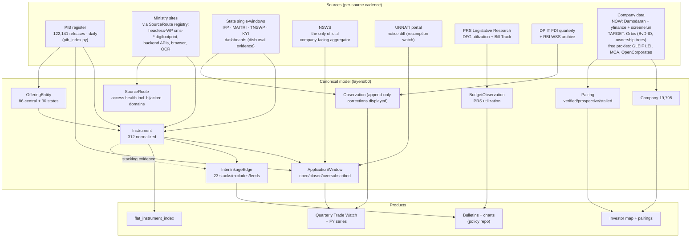

# Data model & information flow

The twin's canonical extraction model lives in [`layers/00_data_model.json`](../layers/00_data_model.json); every sweep and refresh maps into its nine entity types. The flat, query-ready product is [`layers/13_flat_instrument_index.json`](../layers/13_flat_instrument_index.json) — **312 instruments** (120 central v2 + 75 central v1 + 117 state) in one schema. The refresh design is [`layers/14_update_engine.json`](../layers/14_update_engine.json).

## Information flow — sources → model → products

## Refresh cadence

| Trigger | Sources | Updates |
|---|---|---|
| Daily | PIB `--update` | new launches, windows |
| Weekly | NSWS, RBI WSS, UNNATI notice | window status, forex context |
| Monthly | top-20 instrument pages | guideline changes |
| Quarterly | full agent sweep, PRS DFG, DPIIT FDI | everything; Trade Watch rebuild |
| Event | Cabinet PRID keyword match, gazette upload, UNNATI notice text change | targeted re-verify |

**Corrections rule** (inherited program-wide): superseded values are retained with a `superseded_on` date and displayed — never silently overwritten. Type case: PM E-DRIVE "closure" that was actually a segment-wise extension.

**Known coverage gap**: unlisted companies. Orbis would close it (ownership trees, unlisted financials) but requires a license; until then GLEIF LEI + MCA + OpenCorporates are the free partial proxies, and the Company entity carries a `bvd_id` slot ready for the upgrade.
